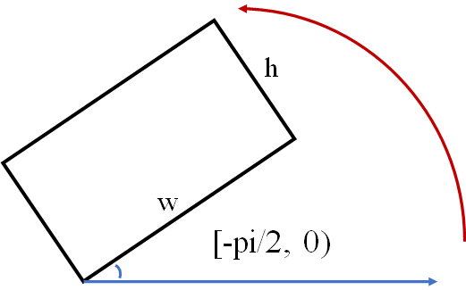
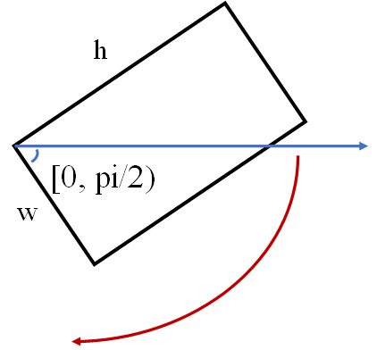
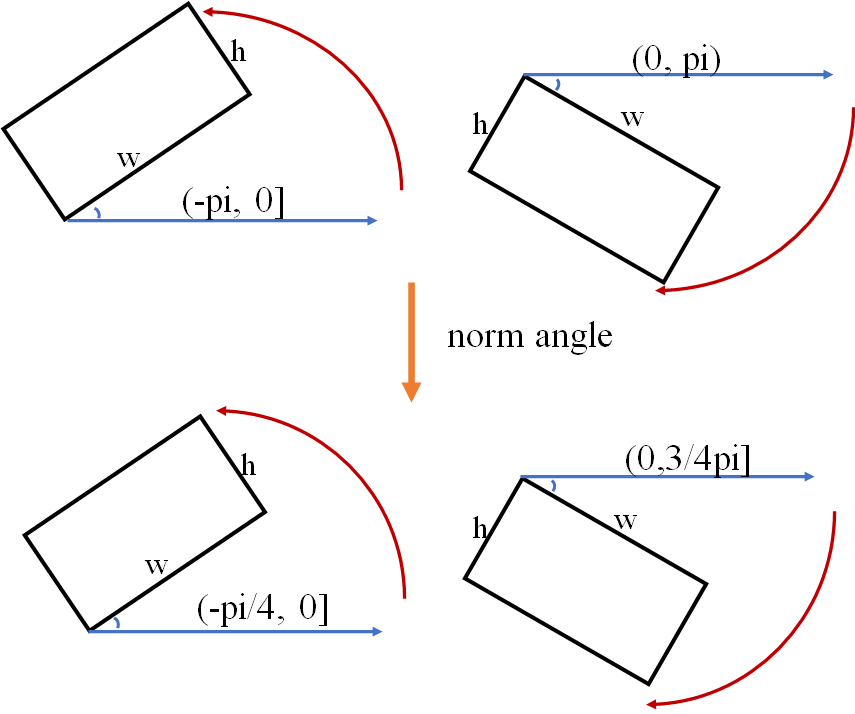
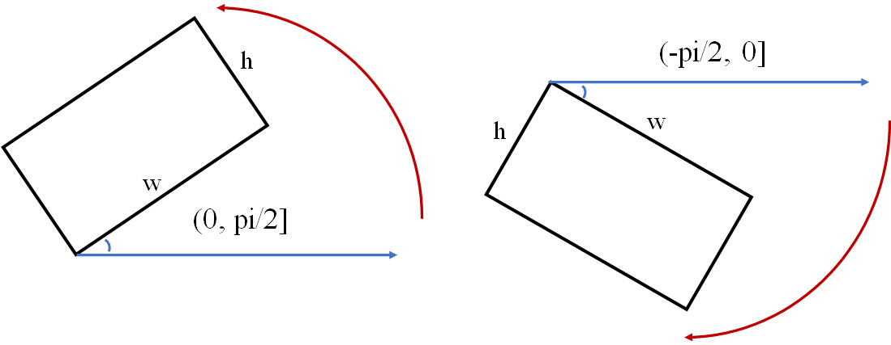

# About angle definition

## version: 'v1', ('oc' in mmrotate) $[-\pi/2, 0)$

you must notice that, cv2.minAreaRect() is different between before opencv=4.5.1 and after opencv==4.5.1.

Before 4.5.1, the function definition follows the guidelines about:

After 4.5.1, the function definition follows the guidelines ablout:

## version: 'v2', ('le135' in mmrotate) $[-\pi/4, 3\pi/4 )$

## version: 'v3', ('le90' in mmrotate) $(-\pi/2, \pi/2]$

### note

In version 'v1' and 'v2', the angle follow the left hand coordinate system, 'v3' is right hand coordinate system